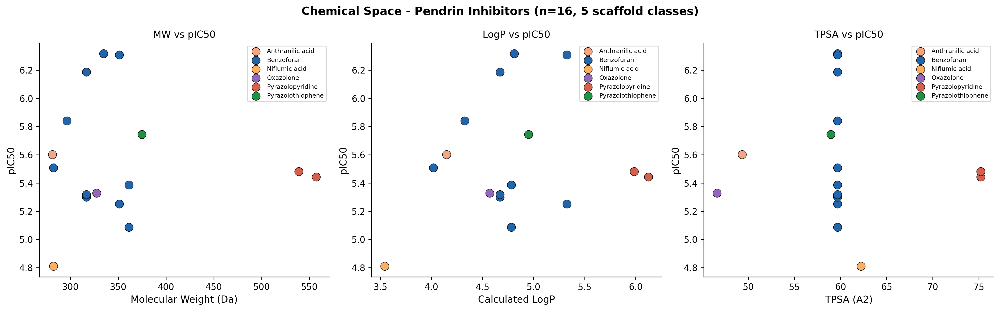
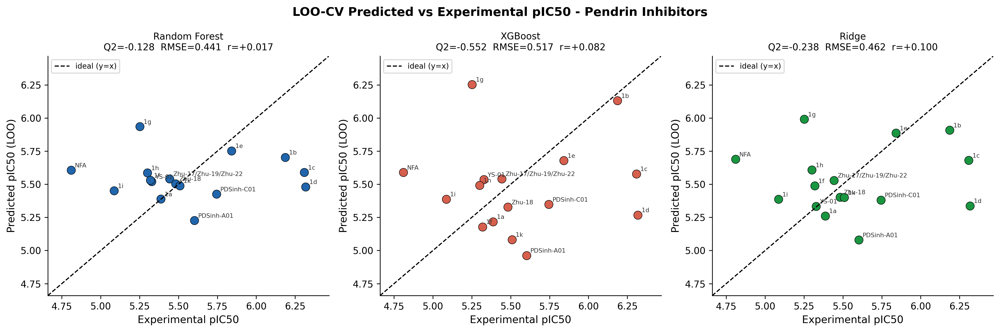
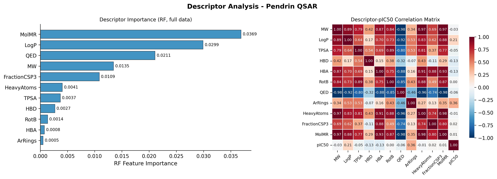
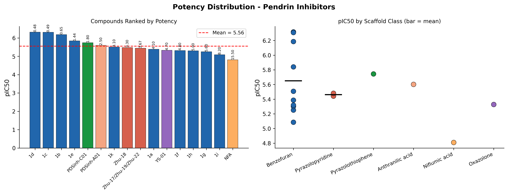
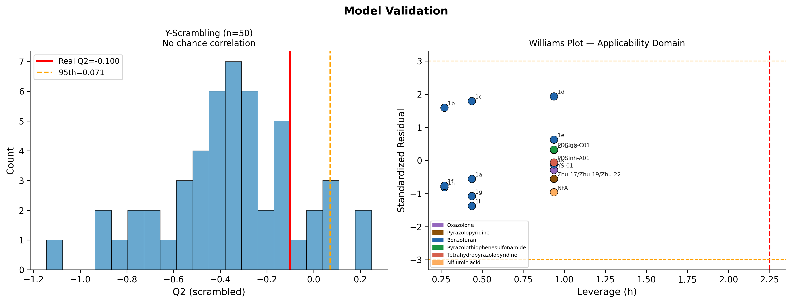
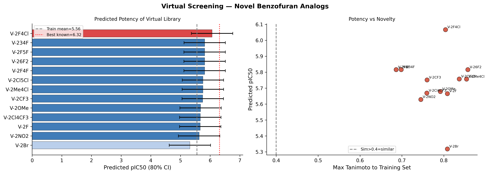

# Pendrin (SLC26A4) QSAR Pipeline

**Author:** Dr. Joy Karmakar  
**Date:** April 2026 | **Version:** 5.0

---

## What this is

An open-source cheminformatics and machine learning pipeline for
**Pendrin (SLC26A4) inhibitors** — a validated drug target for
edema, hypertension, cystic fibrosis, and asthma.

Covers the full QSAR workflow: data curation → feature engineering →
model training → rigorous validation → applicability domain →
conformal prediction → virtual screening.

---

## Run instantly — no installation needed

Click the Colab badge above → **Runtime → Run all** → done in ~90 seconds.  
Generates 6 publication figures + 2 CSV files automatically.

---

## Results at a glance

### Figure 1 — Chemical Space

*MW, LogP and TPSA plotted against pIC50, coloured by scaffold class.
Benzofurans (blue) cluster tightly. No single descriptor drives potency —
justifying the need for fingerprint-based ML.*

---

### Figure 2 — LOO-CV Model Performance

*Leave-One-Out Cross-Validation predicted vs experimental pIC50 for all
4 models. Q² < 0 is expected and honest at n=16 with 1.5 log units of
activity range. Models are proof-of-concept; ≥50 compounds needed for
predictive QSAR.*

---

### Figure 3 — Descriptor Analysis

*Left: Random Forest feature importance for 11 physicochemical
descriptors. QED, MolMR and LogP contribute most.
Right: Descriptor–pIC50 correlation heatmap — no single descriptor
correlates significantly with activity (all p > 0.05).*

---

### Figure 4 — Activity Distribution

*Left: All 16 compounds ranked by potency with IC50 labels.
Right: pIC50 by scaffold class — benzofurans span the widest range
(0.48–8.2 µM), confirming substituent pattern matters greatly.*

---

### Figure 5 — Model Validation

*Left: Y-scrambling histogram (n=50 permutations). Real model Q²=−0.100
lies below the 95th percentile of scrambled models — no chance
correlation.  
Right: Williams plot (applicability domain). All 16 compounds have
leverage h < h\*=2.250 and |standardized residual| < 3 — all
predictions are within the reliable domain.*

---

### Figure 6 — Virtual Screening

*Left: 13 novel benzofuran analogs ranked by predicted pIC50 with 80%
conformal prediction intervals.  
Right: Potency vs novelty — compounds upper-right are both more potent
and more novel.  
**Top hit: V-2F4Cl** (2-fluoro, 4-chloro benzyl) — predicted IC50 =
0.86 µM, Tanimoto similarity to lead 1d = 0.804.*

---

## Dataset

**18 raw entries → 16 unique structures** across 6 scaffold classes.
All SMILES manually verified against primary literature and ChEMBL.

| Scaffold | n | Best IC50 | Reference |
|---|---|---|---|
| Benzofuran | 10 | **0.48 µM** (1d) | Master et al. *Eur J Med Chem* 2025 |
| Pyrazolopyridine | 2 | 3.3 µM (Zhu-18) | Zhu et al. *Bioorg Med Chem Lett* 2019 |
| Tetrahydropyrazolopyridine | 1 | 2.5 µM (PDSinh-A01) | Haggie et al. *FASEB J* 2016 |
| Pyrazolothiophenesulfonamide | 1 | 1.8 µM (PDSinh-C01) | Haggie et al. *FASEB J* 2016 |
| Oxazolone | 1 | 4.7 µM (YS-01) | Park et al. *J Allergy Clin Immunol* 2019 |
| Niflumic acid | 1 | 15.5 µM (NFA) | Wang et al. *Nat Commun* 2024 |

---

## Methods

### Features
- **11 physicochemical descriptors** (RDKit): MW, LogP, TPSA, HBD,
  HBA, RotB, QED, ArRings, HeavyAtoms, FractionCSP3, MolMR
- **ECFP4 fingerprints** — radius=2, 2048 bits

### Models & Validation

| Model | Q² (LOO) | RMSE | MAE | Pearson r |
|---|---|---|---|---|
| Random Forest | −0.100 | 0.435 | 0.330 | +0.009 |
| XGBoost | −0.392 | 0.490 | 0.360 | +0.151 |
| Ridge Regression | −0.132 | 0.442 | 0.325 | +0.149 |
| PLS (n=2) | −0.468 | 0.503 | 0.448 | −0.163 |

| Validation | Result |
|---|---|
| Y-scrambling (n=50) | No chance correlation (real Q² below 95th pct) |
| Scaffold-based split | External Q²=−0.779, RMSE=0.393 |
| Applicability Domain | All 16 compounds within AD (h < 2.250) |
| Conformal prediction | 80% CI = ±0.698 pIC50 (≈5× in IC50) |

---

## Files

| File | Description |
|---|---|
| `pendrin-qsar.ipynb` | Full Colab notebook |
| `pendrin_inhibitors.csv` | Curated dataset (18 entries, corrected) |
| `pendrin_compound_table_pub.csv` | Publication table with descriptors |
| `virtual_screening_results.csv` | 13 virtual analogs with predicted IC50 |
| `fig1–fig6.png` | All figures at 300 dpi |
| `LICENSE` | MIT License |

---

## How to add your own compound

Scroll to the `csv_data` block in the notebook and add a row: MyCompound,CC1=C(C(=O)O)c2cc(OCc3...your SMILES...)ccc2O1,2.0,My Lab 2026,Benzofuran

---

## Roadmap

- [ ] Expand to ≥50 compounds 
- [ ] Add confirmed inactive compounds (IC50 > 50 µM) as decoys
- [ ] Synthesize and test top virtual screening hit V-2F4Cl
- [ ] Deploy Gradio web app for non-programmer use
- [ ] Structure-based QSAR using pendrin cryo-EM structure
      (Wang et al. *Nat Commun* 2024, PDB: 8E5B)
---

## Citation

If you use or build upon this work, please cite:

> Karmakar, J. (2026). *pendrin-qsar: RDKit + ML pipeline for
> SLC26A4 inhibitors* (v5.0).
> 
> GitHub. https://github.com/drjoykarmakar/pendrin-qsar

---

## References

1. Master RJ, Karmakar J, et al. High potency 3-carboxy-2-methylbenzofuran
   pendrin inhibitors as novel diuretics. *Eur J Med Chem* 283, 117133 (2025).

2. Haggie PM, et al. Inhibitors of pendrin anion exchange identified in a
   small molecule screen increase airway surface liquid volume in cystic
   fibrosis. *FASEB J* 30, 2187–2197 (2016).

3. Zhu J, et al. Synthesis and evaluation of tetrahydropyrazolopyridine
   inhibitors of SLC26A4 (pendrin). *Bioorg Med Chem Lett* 29 (2019).

4. Park J, et al. Novel pendrin inhibitor attenuates airway
   hyperresponsiveness in experimental murine asthma.
   *J Allergy Clin Immunol* 144, 1425–1428 (2019).

5. Wang L, et al. Mechanism of anion exchange and small-molecule
   inhibition of pendrin. *Nat Commun* 15, 346 (2024).

---

## Author

**Dr. Joy Karmakar**    
GitHub: [@drjoykarmakar](https://github.com/drjoykarmakar)

---

*Generated with Python 3, RDKit, scikit-learn, XGBoost | April 2026*

